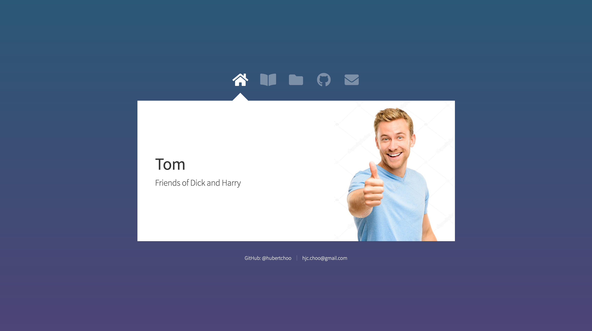
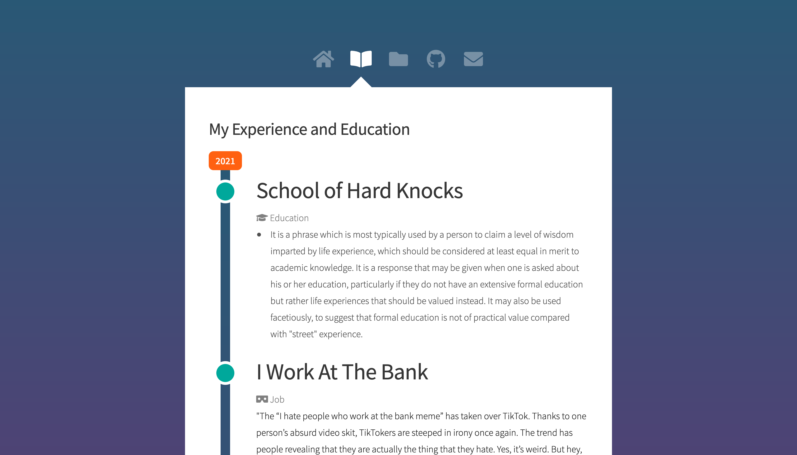
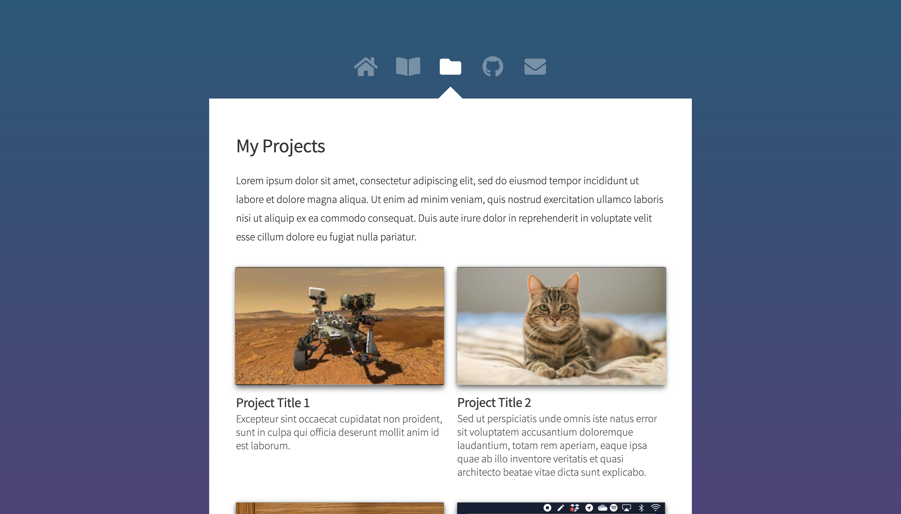

# Stellar on Jekyll

This is Stellar, my custom Jekyll theme. It is built on top of 'Astral' by HTML5 Up.





You can also interact with it at https://hubertchoo.github.io/.

# Installing the theme

You can use this Jekyll theme as a remote theme without need for installation.

Follow the instructions: https://github.com/benbalter/jekyll-remote-theme

Set the `remote_theme` in your `_config.yml` as:
```yml
remote_theme: hubertchoo/stellar-jekyll-theme
```

# Setting It Up

## Home Page + Work Page Description
You only have to edit the front matter in `index.markdown`
```yml
layout: index
my_name: John Appleseed
my_description: Student
profilepic_path: my_photo.png
work_description: Lorem ipsum dolor sit amet, consectetur adipiscing elit, sed do eiusmod tempor incididunt ut labore et dolore magna aliqua. Ut enim ad minim veniam, quis nostrud exercitation ullamco laboris nisi ut aliquip ex ea commodo consequat.
```

## Experience and Education
Under the `_my_experience_education` directory, a sample MD file with the relevant front matter are provided. Merely make copies for the MD file for each entry and include the relevant information.
```yml
name: Test School
icon_name: graduation-cap # FontAwesome Icon Name
type: Education
year: 2018
date: 2018/12/01 # YYYY/MM/DD
description: This is my test school.
```
Other available FontAwesome icons can be found at https://fontawesome.com/v5.15/icons?d=gallery&p=2&s=brands,regular,solid.

## My Projects
Under the `_my_projects` directory, a sample MD file with the relevant front matter are provided. Merely make copies for the MD file for each entry and include the relevant information.
```yml
thumbnail: /project_thumbnails/test.mp4 # MP4 Video
name: TestProject
description: This is a test project.
```
Store your MP4 project thumbnail in the `project_thumbnails` directory. The thumbnail will be autoplayed.

## Config.YML
There are also some additional site settings in the `_config.yml` provided.
Specifically, an additional configuration feature is the `socials` tag as well as Google Analytics data.
```yml
socials:
  # Those that have blank urls will be ignored
  # You can add more of your desired socials
  # Set the names of the socials to be the same as the webicon
  Github: # This corresponds to the name of the FontAwesome Icon
    username: "@hubertchoo"
    link: https://github.com/hubertchoo/
  GitLab:
    username:
    link:
  Twitter:
    username:
    link:
  Instagram:
    username:
    link:
  LinkedIn:
    username:
    link:
  Facebook:
    username:
    link:

# Add in these if you are using google analytics
google_analytics_id:
google_analytics_domain:
```
Those socials filled in will automatically be added as navigation tabs. You can add your own socials, as long as the names correspond the their Font Awesome icon.


# Credits

Below is the README for Astral from HTML5:

```
Astral by HTML5 UP
html5up.net | @ajlkn
Free for personal and commercial use under the CCA 3.0 license (html5up.net/license)


First of its kind on H5U! Astral features a flat, minimalistic design, a fully animated
interface (with noscript fallbacks), and styling for all basic page elements (including
blockquotes, tables and lists). Enjoy!

Demo images* courtesy of Unsplash, a radtastic collection of CC0 (public domain) images
you can use for pretty much whatever.

(* = Not included)

Feedback, bug reports, and comments are not only welcome, but strongly encouraged :)

AJ
aj@lkn.io | @ajlkn

PS: Not sure how to get that contact form working? Give formspree.io a try (it's awesome).


Credits:

	Demo Images:
		Unsplash (unsplash.com)

	Icons:
		Font Awesome (fontawesome.io)

	Other:
		jQuery (jquery.com)
		Responsive Tools (github.com/ajlkn/responsive-tools)
```